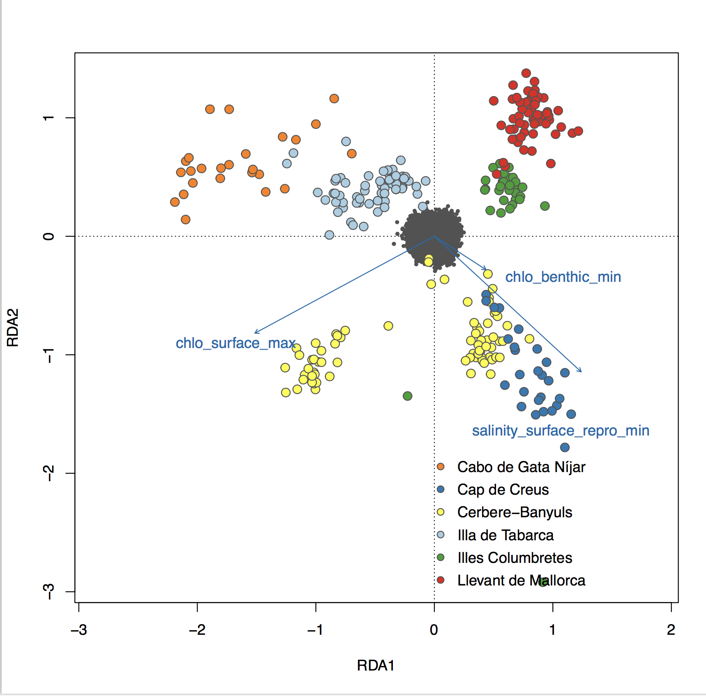

# RDA 

# RDA analysis

RDA analysis adapted from the nice workflow of Brenna Forester available in [popgennescent](https://popgen.nescent.org/2018-03-27_RDA_GEA.html)

Developed by [Laura Benestan](https://github.com/laurabenestan) in
[Stephanie Manel](https://sites.google.com/site/stephaniemanel/home)'s
laboratory for the Reservebenefit project.

## Concept and definition

We used of Redundancy Analysis (RDA) as a genotype-environment association (GEA) method to simultaneously assess the percent of genomic variation explained by environmental variables and to detect loci under selection (see the relevant paper of [Forester et al. 2018](https://onlinelibrary.wiley.com/doi/abs/10.1111/mec.14584). 
RDA is a two-step analysis in which genetic and environmental data are analyzed using multivariate linear regression. 
Then PCA of the fitted values is used to produce canonical axes, which are linear combinations of the predictors (Legendre & Legendre, 2012). Here, we performed the RDA on a individual-based sampling design rather than population-based (see [Benestan et al. 2016] paper (https://onlinelibrary.wiley.com/doi/10.1111/mec.13811)).

## Application to our dataset

Here, we apply RDA to genomic data from 276 individuals of the white seabream (***Diplodus sargus***) sampled across the Mediterranean sea. 

Then, we analyse Results of the RDA at the full set of 18,512 single nucleotide polymorphism (SNP) markers. 
The goal of this study is to understand which environmental factor may drive the genomic divergence observed in this species. 
In this case, the data is individual-based, and inputs are allele counts (i.e. 0/1/2) for each locus and individual fish. 

## 1. Preparing inputs files and loading libraries

**Download R packages**
First, we install the necessary packages and then download the corresponding libraries.

``` {r}
library(psych)    
library(vegan)
library(adegenet)
library(dplyr)
library(fmsb)
library(gsl)
```

Obtain **raw format** from vcf file using [VCFTOOLS](http://vcftools.sourceforge.net) and [PlINK](http://zzz.bwh.harvard.edu/plink/)

Transform the vcf format into a tped plink format
``` {r}, engine="bash",
vcftools --vcf yournameoffile.vcf --plink-tped --out yournameoffile
done
```

Then transform the plink format to a raw format by re-running the following command on your terminal.
 ``` {r}, engine="bash",
plink --tped yournameoffile.tped --tfam yournameoffile.tfam --recodeA yournameoffile
done
```

## 2. Start to download the genomic and environment data in R

```{r}
plink_diplodus <- read.table("yournameoffile.raw", header=TRUE, sep=" ", row.names=1)
dim(plink_diplodus)
```

**Prepare genomic data**.

We remove the names of the samples as we don't consider these values when we will fill the missing values.
Yet other way to handle the missing values and before doing this step visualize patterns of missingness and perform map-independent imputations of missing genotypes using [grur package](https://github.com/thierrygosselin/grur)

```{r}
gen <- plink_diplodus[,6:37029]
```

We **calculate the percent of missing data**.
Multivariate analysis are very sensitive to missing data and these missing needs to be filled.
```{r}
sum(is.na(gen))# 553,232 NAs in the matrix (~3% missing data)
```

Missing values are then filled using the overall average of the allele frequency variation.
```{r}
gen.imp <- apply(gen, 2, function(x) replace(x, is.na(x), as.numeric(names(which.max(table(x))))))
sum(is.na(gen.imp)) # No NAs
```

We **download environmental data** in R.
```{r}
env <- read.table("276ind-24env-variables.txt",sep="\t",header=T) # for diplodus
str(env)
```

Prepare **the environmental data**.

We change the class of the labels.
```{r}
env$labels <- as.character(env$labels)
```

We remove one of the highly correlated predictors by visually and quantitatively checking the correlation among predictors using the function called `pairs.panels`.

```{r}
pairs.panels(env[,2:25], scale=T)
```


We create a **correlation matrix**.
```{r}
matrix_cor <- cor(env[,2:25])
```

We select the non-correlated variables.
```{r}
env_selected <- select(env, salinity_surface_repro_min,chlo_surface_max,chlo_benthic_min) 
```

## 3. Run the Redundancy Analysis (RDA)

This step can take a while depending on your dataset.
```{r}
diplodus.rda <- rda(gen.imp ~ ., data=pred, scale=T)
```

The `R^2` inform about the percent of genomic variation that can be explained by one of the predictor.
Here for instance, we found a adjusted R^2 of 0.0002, which means that our constrained ordination explains about 0.02% of the variation.

This low explanatory power is not surprising given that we expect that most of the SNPs in our dataset will not show a relationship with the environmental predictors (e.g., most SNPs will be neutral).

We **calculate the adjusted R^2**.
```{r}
RsquareAdj(diplodus.rda)
```

We observed the eigenvalues for the constrained axes reflect the variance explained by each canonical axis.
```{r}
summary(eigenvals(diplodus.rda, model = "constrained")
screeplot(diplodus.rda)
```

We load the species scores for the first three constrained axes.
```{r}
load.rda <- scores(diplodus.rda, choices=c(1:3), display="species")  
```

Then we tested the significance of the RDA.
```{r}
signif.full <- anova.cca(diplodus.rda, parallel=getOption("mc.cores")) # default is permutation=999
signif.full
```
## 4. Visualize the RDA outcomes in a nice graph

We **plot the RDA results**.
```{r}
plot(diplodus.rda, scaling=3) 
plot(diplodus.rda, choices = c(1, 3), scaling=3)
```
We add the grouping information, here the Marine Protected Areas info.
```{r}
mpa_group <- read.table("population-map-276ind-diplodus-mpa.txt",header=TRUE,sep="\t")
mpa_env <- cbind(env, mpa_group)
eco <- mpa_group$STRATA
```

We select a palette of colors to use for each MPA.
```{r}
### 6 nice colors for the MPA
bg <- c("#ff7f00","#1f78b4","#ffff33","#a6cee3","#33a02c","#e31a1c")
```

We save the nice RDA plot.
```{r}
pdf("RDA_outside_inside.pdf",width=10,height=10)
plot(diplodus.rda, type="n", scaling=3)
points(diplodus.rda, display="species", pch=20, cex=0.7, col="gray32", scaling=3)           # the SNPs
points(diplodus.rda, display="sites", cex=1.3, scaling=3, col = bg[as.numeric(eco)],pch =21) 
text(diplodus.rda, scaling=3, display="bp", col="#0868ac", cex=1)                           # the predictors
legend("bottomright", legend=levels(eco), bty="n", col="gray32", pch=21, cex=1, pt.bg=bg)
dev.off()
```



We extract individuals information and save it for publication needs.

```
rda_indv <- as.data.frame(scores(diplodus.rda, display=c("sites")))
write.table(rda_indv, "rda_diplodus_276ind.txt", quote=FALSE, row.names=TRUE)
```
